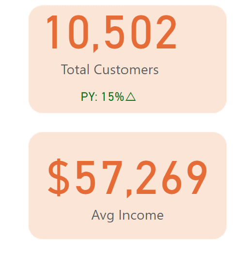
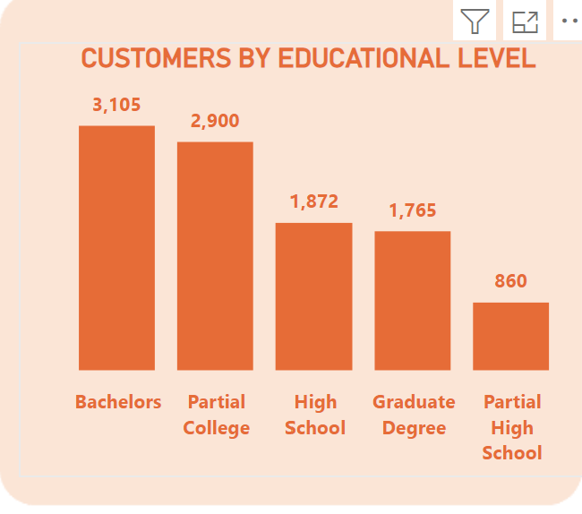

# AdventureWorks-Analysis
## By Ifeoma Amadike 

---

## INTRODUCTION 
This project is a data analytics initiative undertaken for Adventure Works, a comprehensive and multi-faceted company engaged in the manufacturing and sale of bicycles, components, and accessories. The primary objective of this analysis is to extract actionable insights from the company's vast dataset, which encompasses a wide range of customer interactions, sales transactions, and demographic information. By leveraging data analytics, we aim to provide a deeper understanding of customer behavior, product performance, and sales trends.
Through this comprehensive analysis, Adventure Works aims to enhance its data-driven decision-making capabilities, optimize business operations, and ultimately drive growth and profitability. The findings from this project will serve as a foundation for strategic initiatives and help the company maintain its competitive edge in the market.

---
## PROBELEM STATEMENT
I tried to solve the following problems with this dataset:

Identify the top 5 customers based on total revenue 

Determine the top 5 products by revenue to understand which products are generating the highest sales.

Analyze the monthly sales trend to identify seasonal patterns, peaks, and troughs in sales performance over a given period.

Assess the distribution of revenue across different geographic locations to identify high-performing and underperforming regions.

Examine the distribution of customers by gender to understand the gender demographics of the customer base and identify any significant trends or imbalances.

Analyze the educational levels of customers to understand the demographic characteristics of the customer base and identify trends related to educational attainment.

---

## DATA SOURCING

---

I got this dataset from Adventure WOrks Dataset Link __

---
## SKILLS DEMONSTRATED

In executing the data analytics initiative for Adventure Works, key skills demonstrated include:
1. Data Cleaning and Preparation with Power Query:
* Efficient Cleaning: Corrected errors, handled missing values, and ensured consistency.
* Transformation: Converted raw data into a usable format with parsed dates and normalized variables.
* Data Analysis and Aggregation:

2. Grouping and Aggregation: Grouped data by categories (e.g., customer, product) and performed aggregate calculations.
* Descriptive Statistics: Calculated key metrics like total revenue and customer counts.

3. Data Visualization with Power BI:
* Trend Analysis: Created time series visualizations to identify seasonal patterns.
* Bar and Pie Charts: Showcased revenue distribution and demographic insights.
* Interactive Dashboards: Built dynamic dashboards for data exploration.

4. Insights and Interpretation:
* Revenue Analysis: Identified top customers and products by revenue.
* Geographic Insights: Assessed revenue distribution to guide expansion.
* Demographic Analysis: Analyzed gender and education demographics for targeted strategies.

---

### DATA MODEL 
To effectively analyze Adventure Works' data and derive actionable insights, i designed a well-structured data model . This data model integrates various key aspects of the business, including customer demographics, product information, and sales transactions, ensuring a comprehensive and coherent approach to data analysis. Below is an introduction to the components and relationships within the data model, illustrated by the accompanying diagram.

---
## ANALYSIS & VISUALIZATIONS

---
The analysis and visualizations for Adventure Works were conducted to extract meaningful insights from the dataset and present them in an easily interpretable format using Power BI. 

---
This project contains two report page/dashboard.
### FIRST DASHBOARD
### ADVENTUREWORKS CUSTOMER REPORT FOR 2017

---
### SECOND REPORT DASHBOARD 
### ADVENTUREWORKS SALES REPORT 2017

---
# KPI
the use of Key Performance Indicators (KPIs) plays a critical role in providing a clear and concise overview of the company's performance. KPIs are augmented with growth comparison arrows to indicate the company's yearly growth, making it easier to interpret performance changes over time.

### ADVENTUREWORKS CUSTOMER REPORT FOR 2017 KPI

### ADVENTUREWORKS SALES REPORT 2017 KPI

---

Below is a summary of the problems/questions  analyses and visualizations created:

Identify the top 5 customers based on total revenue 

---
Determine the top 5 products by revenue to understand which products are generating the highest sales.

---
Analyze the monthly sales trend to identify seasonal patterns, peaks, and troughs in sales performance over a given period.

---
Assess the distribution of revenue across different geographic locations to identify high-performing and underperforming regions.

---
Examine the distribution of customers by gender to understand the gender demographics of the customer base and identify any significant trends or imbalances.

---
Analyze the educational levels of customers to understand the demographic characteristics of the customer base and identify trends related to educational attainment.

---
Identify the customers country

---
Analyze the customers income category segment

---

## RECOMMENDATIONS

Based on the analysis conducted for Adventure Works, several key recommendations have emerged to help the company optimize its operations and drive future growth:

* Focus on High-Value Customers: The top 5 customers by revenue should be prioritized for personalized marketing campaigns and loyalty programs. Enhancing the relationship with these customers could lead to increased sales and long-term loyalty.

* Optimize Inventory for Top-Selling Products: Given the identification of the top 5 products by revenue, Adventure Works should ensure adequate inventory levels for these items. Additionally, marketing efforts should emphasize these popular products to maximize sales.

* Leverage Seasonal Trends: The monthly sales trend analysis has revealed specific periods of peak sales. Adventure Works should align marketing campaigns, promotions, and inventory planning with these seasonal trends to capitalize on high-demand periods.

* Strategic Geographic Expansion: The revenue distribution analysis indicates high-performing regions that should be targeted for further market penetration. Conversely, underperforming regions may require tailored strategies or additional market research to understand and address the barriers to sales.

* Targeted Marketing by Gender: Understanding the gender demographics of the customer base allows for more precise marketing. Adventure Works can develop gender-specific marketing campaigns and product offerings to appeal to the distinct preferences of male and female customers.

* Educational Level Insights for Product Development: The analysis of customers' educational levels provides valuable demographic insights. Adventure Works can use this information to tailor its product development and marketing strategies to better meet the preferences and needs of customers with different educational backgrounds.

---

## CONCLUSION
The data analytics initiative undertaken for Adventure Works has provided a wealth of insights into various aspects of the company's operations. By identifying key customers, top-performing products, and understanding sales trends and demographic characteristics, Adventure Works is well-positioned to make informed, data-driven decisions.

The analysis has highlighted the importance of focusing on high-value customers and optimizing inventory for top-selling products. Seasonal trends in sales performance suggest opportunities for strategic marketing and inventory planning, while the geographic revenue distribution underscores the need for targeted regional strategies.

Understanding customer demographics, including gender and educational level, further enables Adventure Works to tailor its marketing and product development efforts to better meet the needs of its diverse customer base.

In conclusion, the insights derived from this project are instrumental in guiding Adventure Works toward enhanced operational efficiency, targeted marketing efforts, and ultimately, sustained growth and profitability. By continuing to leverage data analytics, Adventure Works can maintain its competitive edge and achieve long-term success in the dynamic marketplace.

